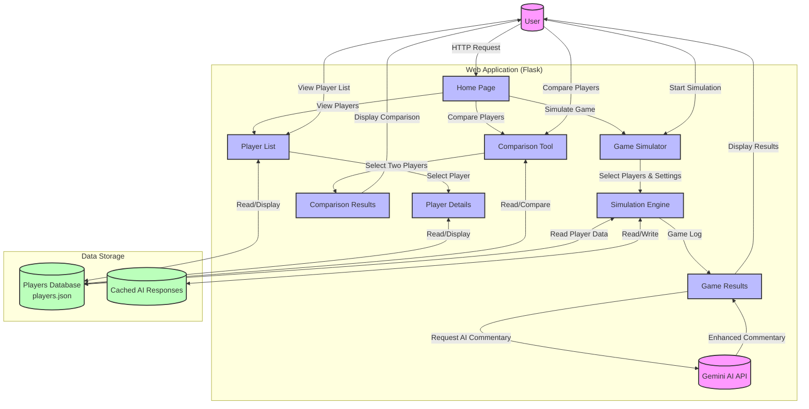

# Data Flow Diagram (DFD) - NBA Player Stat Viewer & Simulator

## Diagram Explanation

### External Entities
- **User**: Interacts with the web application through a browser
- **Gemini API**: External AI service for generating enhanced game commentary

### Main Processes
1. **Web Application (Flask)**
   - **Home Page**: Entry point with navigation options
   - **Player List**: Displays all available players
   - **Player Details**: Shows detailed statistics for a single player
   - **Comparison Tool**: Allows side-by-side comparison of two players
   - **Game Simulator**: Interface for configuring and running 1-on-1 simulations
   - **Simulation Engine**: Core logic for running basketball simulations
   - **Game Results**: Displays simulation outcomes and statistics

### Data Stores
- **Players Database (players.json)**: Stores all player statistics and information
- **Cached AI Responses**: Stores previously generated AI commentary to reduce API calls

### Data Flows
- Solid arrows represent data flow between components
- Dotted lines represent external API interactions
- Processes can read from and write to data stores as needed

### Key Interactions
1. User interactions flow through the web interface to the Flask backend
2. Player data is read from the JSON database as needed
3. Game simulations process player stats through the simulation engine
4. AI commentary is optionally generated through the Gemini API
5. Results are formatted and displayed back to the user

This diagram provides a high-level overview of how data moves through your application, from user input through processing and storage to output display.
