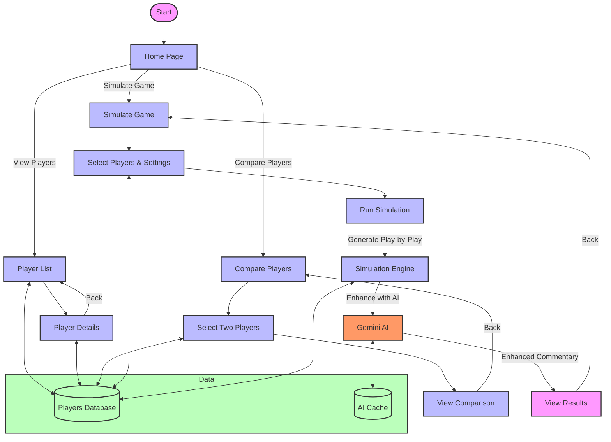

# NBA Player Stat Viewer & Simulator - Flowchart

## Flowchart Explanation

### Main Navigation Paths
1. **View Players**
   - Browse the complete list of NBA players
   - View detailed statistics for any player

2. **Compare Players**
   - Select two players for side-by-side comparison
   - View statistical comparison

3. **Simulate Game**
   - Choose two players to face off
   - Configure game settings
   - Run the simulation
   - View detailed results with AI-enhanced commentary

### Data Flow
- All player data is stored in the Players Database (players.json)
- AI-generated content is cached to improve performance
- The simulation engine processes player statistics to generate realistic game outcomes

### Key Features
- Clean, intuitive navigation
- Responsive design for all devices
- Realistic basketball simulation
- AI-enhanced game commentary
- Performance-optimized with caching
